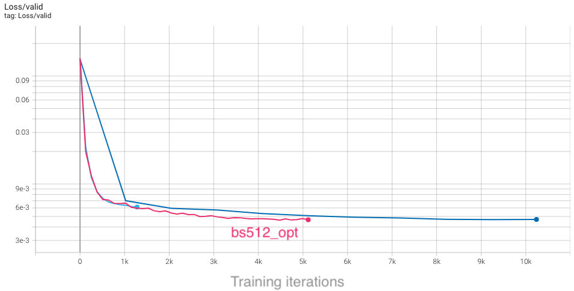

# 2022 Perlmutter User Training: Deep Learning Hands-on

This repository contains the example code material for the deep learning hands-on section of the 2022 Perlmutter User Training.

**Contents**
* [Links](#links)
* [Installation](#installation-and-setup)
* [Model, data, and code overview](#model-data-and-training-code-overview)
* [Single GPU training](#single-gpu-training)
* [Single GPU performance](#single-gpu-performance-profiling-and-optimization)
* [Distributed training](#distributed-gpu-training)
* [Multi GPU performance](#multi-gpu-performance-profiling-and-optimization)
* [Putting it all together](#putting-it-all-together)

## Links

Presentation slides: https://docs.google.com/presentation/d/1ov-O11Q90g7r-Hs8cGCHBtrq0yms0pm2oO4lR01gExI/edit?usp=sharing

NERSC JupyterHub: https://jupyter.nersc.gov

Data download: https://portal.nersc.gov/project/dasrepo/pharring/

## Installation and Setup

### Software environment

We recommend accesssing Perlmutter for this hands-on via [jupyter.nersc.gov](https://jupyter.nersc.gov). 
Once logged into the hub, start a session by clicking the button for Perlmutter Shared CPU Node (other options will not work with this tutorial material). This will open up a session on a Perlmutter login node, from which you can submit jobs to the GPU nodes and monitor their progress.

To begin, start a terminal from JupyterHub and clone this repository with:
```bash
git clone https://github.com/NERSC/ml-pm-training-2022.git
```
You can use the Jupyter file browser to view and edit source files and scripts. For all of the example commands provided below, make sure you are running them from within the top-level folder of the repository. In your terminal, change to the directory with
```bash
cd ml-pm-training-2022
```

Alternately, users may access Perlmutter via ssh, but we still recommend using Jupyter for viewing TensorBoard logs output by the hands-on exercises.

For running slurm jobs on Perlmutter, we will use training accounts which are provided under the `ntrain3` project. The slurm script `submit_pm.sh` included in the repository is configured to work automatically as is, but if you submit your own custom jobs via `salloc` or `sbatch` you must include the following flags for slurm:
* `-A ntrain3_g` is required for training accounts
* `--reservation=perlmutter_day3` is required to access the set of GPU nodes we have reserved for the duration of the hands-on.

The code can be run using the `romerojosh/containers:sc21_tutorial` docker container. On Perlmutter, docker containers are run via [shifter](https://docs.nersc.gov/development/shifter/), and this container is already downloaded and automatically invoked by our job submission scripts. Our container is based on the [NVIDIA ngc 21.10 pytorch container](https://docs.nvidia.com/deeplearning/frameworks/pytorch-release-notes/rel_21-10.html#rel_21-10), with a few additional packages added. See the dockerfile in [`docker/Dockerfile`](docker/Dockerfile) for details.

## Model, data, and training code overview

The model in this repository is adapted from a cosmological application of deep learning ([Harrington et al. 2021](https://arxiv.org/abs/2106.12662)), which aims to augment computationally expensive simulations by using a [U-Net](https://arxiv.org/abs/1505.04597) model to reconstruct physical fields of interest (namely, hydrodynamic quantities associated with diffuse gas in the universe):


The U-Net model architecture used in these examples can be found in [`networks/UNet.py`](networks/UNet.py). U-Nets are a popular and capable architecture, as they can extract long-range features through sequential downsampling convolutions, while fine-grained details can be propagated to the upsampling path via skip connections. This particular U-Net is relatively lightweight, to better accommodate our 3D data samples.

The basic data loading pipeline is defined in [`utils/data_loader.py`](utils/data_loader.py), whose primary components are:
* The `RandomCropDataset` which accesses the simulation data stored on disk, and randomly crops sub-volumes of the physical fields to serve for training and validation. For this repository, we will be using a crop size of 64^3
* The `RandomRotator` transform, which applies random rotations and reflections to the samples as data augmentations
* The above components are assembled to feed a PyTorch `DataLoader` which takes the augmented samples and combines them into a batch for each training step.

It is common practice to decay the learning rate according to some schedule as the model trains, so that the optimizer can settle into sharper minima during gradient descent. Here we opt for the cosine learning rate decay schedule, which starts at an intial learning rate and decays continuously throughout training according to a cosine function. This is handled by the `lr_schedule` routine defined in [`utils/__init__.py`](utils/__init__.py), which also has logic to implement learning rate scaling and warm-up for use in the [Distributed GPU training](#Distributed-GPU-training) section

The script to train the model is [`train.py`](train.py), which uses the following arguments to load the desired training setup:
```
--yaml_config YAML_CONFIG   path to yaml file containing training configs
--config CONFIG             name of desired config in yaml file
```

Based on the selected configuration, the train script will then:
1.  Set up the data loaders and construct our U-Net model, the Adam optimizer, and our L1 loss function.
2.  Loop over training epochs to run the training. See if you can identify the following key components: 
    * Looping over data batches from our data loader.
    * Applying the forward pass of the model and computing the loss function.
    * Calling `backward()` on the loss value to backpropagate gradients. Note the use of the `grad_scaler` will be explained below when enabling mixed precision.
    * Applying the model to the validation dataset and logging training and validation metrics to visualize in TensorBoard (see if you can find where we construct the TensorBoard `SummaryWriter` and where our specific metrics are logged via the `add_scalar` call).

More info on the model and data can be found in the [slides](https://docs.google.com/presentation/d/1ov-O11Q90g7r-Hs8cGCHBtrq0yms0pm2oO4lR01gExI/edit). If you are experimenting with this repository after the training date, you can download the data from here: https://portal.nersc.gov/project/dasrepo/pharring/.
Note that you will have to adjust the data path in `submit_pm.sh` to point to your personal copy after downloading.


## Single GPU training

First, let us look at the performance of the training script without optimizations on a single GPU.

On Perlmutter for the hands-on, we will be submitting jobs to the batch queue. To submit this job, use the following command:
```
sbatch -n 1 ./submit_pm.sh --config=short --num_epochs 3
```
`submit_pm.sh` is a batch submission script that defines resources to be requested by SLURM as well as the command to run.
Note that any arguments for `train.py`, such as the desired config (`--config`), can be added after `submit_pm.sh` when submitting, and they will be passed to `train.py` properly.
When using batch submission, you can see the job output by viewing the file `pm-crop64-<jobid>.out` in the submission
directory. You can find the job id of your job using the command `squeue --me` and looking at the first column of the output.

For interactive jobs, you can run the Python script directly using the following command (**NOTE: please don't run training on the Perlmutter login nodes**):
```
python train.py --config=short --num_epochs 3
```
For V100 systems, you will likely need to update the config to reduce the local batch size to 32 due to the reduced memory capacity. Otherwise, instructions are the same.

This will run 3 epochs of training on a single GPU using a default batch size of 64.
See [`config/UNet.yaml`](config/UNet.yaml) for specific configuration details.
Note we will use the default batch size for the optimization work in the next section
and will push beyond to larger batch sizes in the distributed training section.

In the baseline configuration, the model converges to a loss of about `4.75e-3` on
the validation dataset in 10 epochs. This takes around 2 hours to run, so to save time we have already included an example TensorBoard log for the `base` config in the `example_logs` directory for you.
We want to compare our training results against the `base` config baseline, and TensorBoard makes this easy as long as all training runs are stored in the same place. 
To copy the example TensorBoard log to the scratch directory where our training jobs will output their logs, do
```
mkdir -p $SCRATCH/ml-pm-training-2022/logs
cp -r ./example_logs/base $SCRATCH/ml-pm-training-2022/logs
```

To view results in TensorBoard, open the [`start_tensorboard.ipynb`](start_tensorboard.ipynb) notebook and follow the instructions in it to launch a TensorBoard session in your browser. Once you have TensorBoard open, you should see a dashboard with data for the loss values, learning rate, and average iterations per second. Looking at the validation loss for the `base` config, you should see the following training curve:


As our training with the `short` config runs, it should also dump the training metrics to the TensorBoard directory, and TensorBoard will parse the data and display it for you. You can hit the refresh button in the upper-right corner of TensorBoard to update the plots with the latest data.

## Single GPU performance profiling and optimization

If you are interested in learning how to profile and optimize your PyTorch
code on Perlmutter, please refer to our full SC21 tutorial material at
https://github.com/NERSC/sc21-dl-tutorial#single-gpu-performance-profiling-and-optimization

### Full training with optimizations
For convenience, we provide a configuration `bs64_opt` with all our optimizations in place. This configuration for single-GPU training is much faster than the `base` configuration, but still takes around 35 minutes to complete fully. In interest of saving time, we have also included an example training log for the `bs64_opt` config in the repository. To view this in TensorBoard, simply copy it to the logs directory:
```
cp -r ./example_logs/bs64_opt $SCRATCH/ml-pm-training-2022/logs
```

Now this run should be visible in TensorBoard, along with the other ones already there. Note the convergence rate per step is the same, but each step takes far less time than the `base` config.

If you want, you can also run the full model training on a single GPU with our optimizations yourself with:
```
sbatch -n 1 -t 40 ./submit_pm.sh --config=bs64_opt
```

## Distributed GPU training

Now that we have model training code that is optimized for training on a single GPU,
we are ready to utilize multiple GPUs and multiple nodes to accelerate the workflow
with *distributed training*. We will use the recommended `DistributedDataParallel`
wrapper in PyTorch with the NCCL backend for optimized communication operations on
systems with NVIDIA GPUs. Refer to the PyTorch documentation for additional details 
on the distributed package: https://pytorch.org/docs/stable/distributed.html

### Code basics

To submit a multi-GPU job, use the `submit_pm.sh` with the `-n` option set to the desired number of GPUs. For example, to launch a training with multiple GPUs, you will use commands like:
```
sbatch -n NUM_GPU submit_pm.sh [OPTIONS]
```
This script automatically uses the slurm flags `--ntasks-per-node 4`, `--cpus-per-task 32`, `--gpus-per-task 1`, so slurm will allocate one process for each GPU we request, and give each process 1/4th of the CPU resources available on a Perlmutter GPU node. This way, multi-node trainings can easily be launched simply by setting `-n` greater than 4.

*Question: why do you think we run 1 task (cpu process) per GPU, instead of 1 task per node (each running 4 GPUs)?*

PyTorch `DistributedDataParallel`, or DDP for short, is flexible and can initialize process groups with a variety of methods. For this code, we will use the standard approach of initializing via environment variables, which can be easily read from the slurm environment. Take a look at the `export_DDP_vars.sh` helper script, which is used by our job script to expose for PyTorch DDP the global rank and node-local rank of each process, along with the total number of ranks and the address and port to use for network communication. In the [`train.py`](train.py) script, near the bottom in the main script execution, we set up the distributed backend using these environment variables via `torch.distributed.init_proces_group`.

When distributing a batch of samples in DDP training, we must make sure each rank gets a properly-sized subset of the full batch. See if you can find where we use the `DistributedSampler` from PyTorch to properly partition the data in [`utils/data_loader.py`](utils/data_loader.py). Note that in this particular example, we are already cropping samples randomly form a large simulation volume, so the partitioning does not ensure each rank gets unique data, but simply shortens the number of steps needed to complete an "epoch". For datasets with a fixed number of unique samples, `DistributedSampler` will also ensure each rank sees a unique minibatch.

In `train.py`, after our U-Net model is constructed,
we convert it to a distributed data parallel model by wrapping it as:
```
model = DistributedDataParallel(model, device_ids=[local_rank])
```

The DistributedDataParallel (DDP) model wrapper takes care of broadcasting
initial model weights to all workers and performing all-reduce on the gradients
in the training backward pass to properly synchronize and update the model
weights in the distributed setting.

*Question: why does DDP broadcast the initial model weights to all workers? What would happen if it didn't?*

### Large batch convergence

To speed up training, we try to use larger batch sizes, spread across more GPUs,
with larger learning rates. The base config uses a batchsize of 64 for single-GPU training, so we will set `base_batch_size=64` in our configs and then increase the `global_batch_size` parameter in increments of 64 for every additional GPU we add to the distributed training. Then, we can take the ratio of `global_batch_size` and `base_batch_size` to decide how much to scale up the learning rate as the global batch size grows. In this section, we will make use of the square-root scaling rule, which multiplies the base initial learning rate by `sqrt(global_batch_size/base_batch_size)`. Take a look at [`utils/__init__.py`](utils/__init__.py) to see how this is implemented.

*Question: how do you think the loss curves would change if we didn't increase the learning rate at all as we scale up?*

*Question: what do you think would happen if we simply increased our learning rate without increasing batch size?*

As a first attempt, let's try increasing the batchsize from 64 to 512, distributing our training across 8 GPUs (thus two GPU nodes on Perlmutter). To submit a job with this config, do
```
sbatch -t 10 -n 8 submit_pm.sh --config=bs512_test
```

Looking at the TensorBoard log, we can see that the rate of convergence is increased initially, but the validation loss plateaus quickly and our final accuracy ends up worse than the single-GPU training:


From the plot, we see that with a global batch size of 512 we complete each epoch in a much shorter amount of time, so training concludes rapidly. This affects our learning rate schedule, which depends on the total number of steps as set in `train.py`:
```
params.lr_schedule['tot_steps'] = params.num_epochs*(params.Nsamples//params.global_batch_size)
```

If we increase the total number of epochs, we will run longer (thus giving the model more training iterations to update weights) and the learning rate will decay more slowly, giving us more time to converge quickly with a larger learning rate. To try this out, run the `bs512_opt` config, which runs for 40 epochs rather than the default 10:
```
sbatch -t 20 -n 8 submit_pm.sh --config=bs512_opt
```
With the longer training, we can see that our higher batch size results are slightly better than the baseline configuration. Furthermore, the minimum in the loss is reached sooner, despite running for more epochs:


Based on our findings, we can strategize to have trainings with larger batch sizes run for half as many total iterations as the baseline, as a rule of thumb. You can see this imlemented in the different configs for various global batchsizes: `bs256_opt`, `bs512_opt`, `bs2048_opt`. However, to really compare how our convergence is improving between these configurations, we must consider the actual time-to-solution. To do this in TensorBoard, select the "Relative" option on the left-hand side, which will change the x-axis in each plot to show walltime of the job (in hours), relative to the first data point:


With this selected, we can compare results between these different configs as a function of time, and see that all of them improve over the baseline. Furthermore, the rate of convergence improves as we add more GPUs and increase the global batch size:


Based on our study, we see that scaling up our U-Net can definitely speed up training and reduce time-to-solution. Compared to our un-optimized single-GPU baseline from the first section, which took around 2 hours to train, we can now converge in about 10 minutes, which is a great speedup! We have also seen that there are several considerations to be aware of and several key hyperparameters to tune. We encourage you to now play with some of these settings and observe how they can affect the results. The main parameters in `config/UNet.yaml` to consider are:

* `num_epochs`, to adjust how long it takes for learning rate to decay and for training to conclude.
* `lr_schedule`, to choose how to scale up learning rate, or change the start and end learning rates.
* `global_batch_size`. We ask that you limit yourself to a maximum of 8 GPUs initially for this section, to ensure everyone gets sufficient access to compute resources.

You should also consider the following questions:
* *What are the limitations to scaling up batch size and learning rates?*
* *What would happen to the learning curves and runtime if we did "strong scaling" instead (hold global batch size fixed as we increase GPUs, and respectively decrease the local batch size)?*

## Multi-GPU performance profiling and optimization

If you are interested in learning how to profile and optimize your multi-GPU PyTorch
code on Perlmutter, please refer to our full SC21 tutorial material at
https://github.com/NERSC/sc21-dl-tutorial#multi-gpu-performance-profiling-and-optimization

## Putting it all together

With all of our multi-GPU settings and optimizations in place, we now leave it to you to take what you've learned and try to achieve the best performance on this problem. Specifically, try to further tune things to either reach the lowest possible validation loss, or converge to the single-GPU validation loss (`~4.7e-3`) in the shortest amount of time. Some ideas for things to adjust are:
* Further tune `num_epochs` to adjust how long it takes for learning rate to decay, and for training to conclude.
* Play with the learning rate: try out a different scaling rule, such as linear scale-up of learning rate, or come up with your own learning rate schedule.
* Change other components, such as the optimizer used. Here we have used the standard Adam optimizer, but many practitioners also use the SGD optimizer (with momentum) in distributed training.

The [PyTorch docs](https://pytorch.org/docs/stable/index.html) will be helpful if you are attempting more advanced changes.

